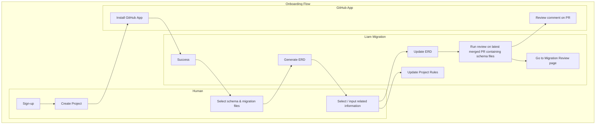
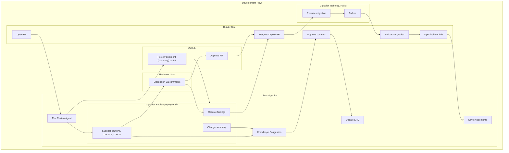
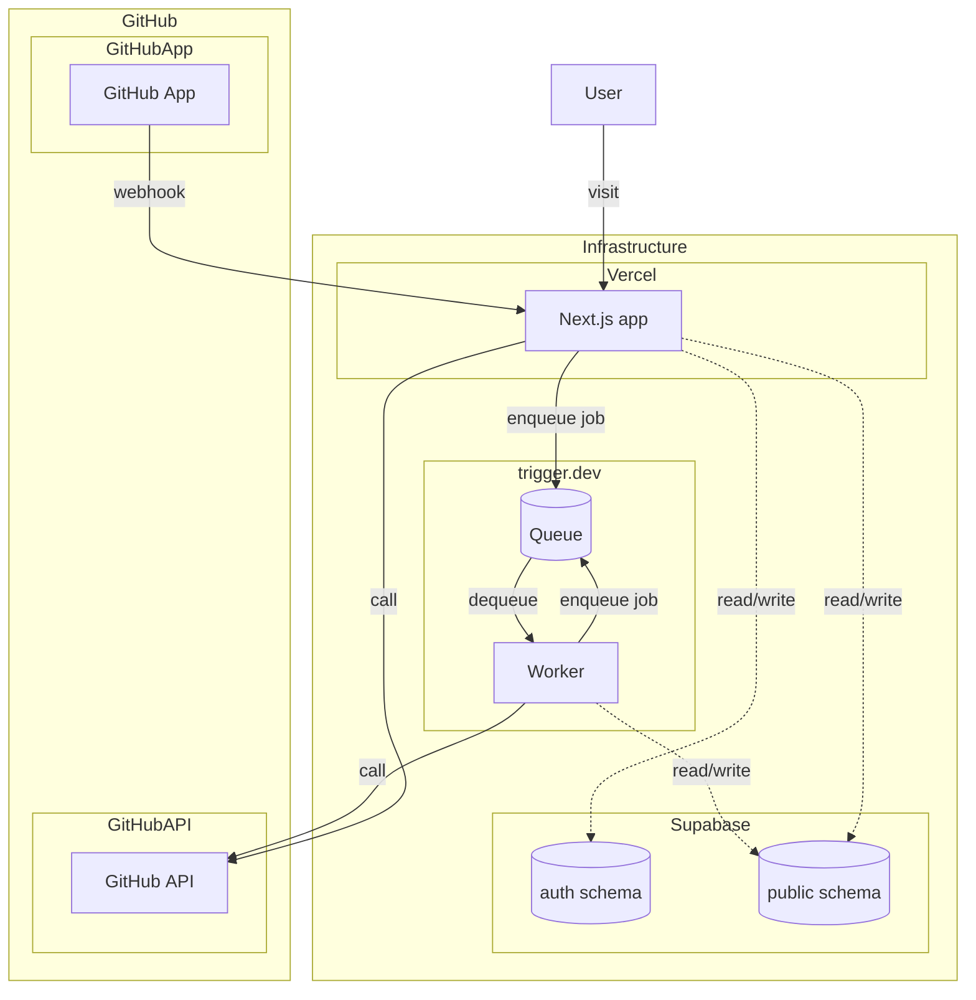

# Liam Migration (Working Title) Product Requirements Document

## Overview

**Liam Migration (working title)** is a new solution that **dramatically reduces the risks and rework costs of increasingly complex database schema changes** through AI assistance and automated reviews, enabling development teams to **iterate safely and quickly**. Going beyond OSS‑based ER‑diagram visualization, it delivers **migration‑diff checks at the pull‑request stage** and **intelligent optimization suggestions**, achieving **both design quality and development speed**.

## Ubiquitous Language

| Term                               | Definition                                                                                                                                                                                                                                                                                                                                                                          |
| ---------------------------------- | ----------------------------------------------------------------------------------------------------------------------------------------------------------------------------------------------------------------------------------------------------------------------------------------------------------------------------------------------------------------------------------- |
| **Liam Migration (working title)** | The product name. An AI‑assisted, automated‑review solution that reduces the risks and rework costs associated with DB schema changes, enabling a safe and rapid development cycle.                                                                                                                                                                                                 |
| **Project**                        | The management unit for a database schema that is continuously updated via migrations. Each Project maps 1‑to‑1 with a GitHub repository and currently owns a single schema. Schema change history and design knowledge are accumulated here.                                                                                                                                       |
| **Branch**                         | A unit of change history managed within a Project. Each Branch maps 1‑to‑1 to a branch in the GitHub repository and stores update context such as Knowledge Suggestions and Migration Reviews. Knowledge content is fetched from the files in the corresponding GitHub branch and therefore varies per branch.                                                                      |
| **Migration**                      | A series of operations that modify the structure (schema) of the database—creating, altering, or dropping tables and columns—to move the DB to its new structure. In this product, _Migration_ refers only to schema changes, not data migration.                                                                                                                                   |
| **Review Agent**                   | An AI component that automatically analyzes the impact scope of a migration and predicts its effects on risk, performance, and data consistency. Continuous learning improves review accuracy.                                                                                                                                                                                      |
| **Migration Review Page**          | A dedicated interface where users can view, in one place, the detailed changes of a migration, points of caution, AI suggestions, and more.                                                                                                                                                                                                                                         |
| **Knowledge**                      | A structured body of information about a Project, composed of three elements—Schema, Docs, and Rules. It evolves continuously through both manual updates and AI‑generated Knowledge Suggestions. Past history is retained, building a repository of design knowledge.                                                                                                              |
| **Schema**                         | Structured data representing the current table structure of the database. It is shown visually to humans as an ERD and provided to the Review Agent as structured text for context.                                                                                                                                                                                                 |
| **Schema Override**                | A feature that allows the structure of **Schema** to be overwritten. The override is reflected in both the ERD and the information fed to the Review Agent.                                                                                                                                                                                                                         |
| **Docs**                           | Markdown documents that users can create freely. Multiple titles and contents can be managed; they are rendered as HTML for humans and supplied as text context to the Review Agent.                                                                                                                                                                                                |
| **Rules**                          | A set of constraints that must be observed in Project migrations: naming conventions, mandatory primary keys, prescribed data types, etc. It includes best practices based on the DB engine and Project‑specific rules. Humans can view it via the UI, and the Review Agent checks for violations against it. There are plans to expose it in the future as a static‑analysis tool. |
| **Knowledge Agent**                | An AI component that triggers on events such as migration reviews, human comments, and ER‑diagram annotation comments, proposing updates to Schema, Docs, and Rules (Knowledge Suggestions). Users can **Approve**, **Reject**, or comment to regenerate the proposals.                                                                                                             |
| **Knowledge Suggestion**           | A proposed update to Schema, Docs, or Rules generated by the Knowledge Agent. Suggestions are managed in a UI accessible from the header menu.                                                                                                                                                                                                                                      |
| **Reviewer User**                  | A human role in the product. Based on AI feedback and automated analysis, this user verifies and approves changes, ensuring safety and quality of the design.                                                                                                                                                                                                                       |
| **Builder User**                   | A human role in the product responsible for executing DB schema changes (code generation and applying migrations). The initial release focuses on Reviewer functionality; Builder support will be added incrementally.                                                                                                                                                              |
| **GitHub App**                     | A mechanism that automates and streamlines pull‑request comments and review approvals via integration with the GitHub repository, supporting a seamless development workflow.                                                                                                                                                                                                       |
| **Liam ERD**                       | An OSS‑based tool for automatic ER‑diagram generation and visualization that predates Liam Migration.                                                                                                                                                                                                                                                                               |

## Background

### Current State

- **Liam ERD** has alleviated the **pain of keeping schemas current and understanding them**—at a level comparable to other OSS tools—through automatic ER‑diagram generation and visualization.
- Additional strengths such as **refined UI/UX**, **support for large numbers of tables**, **CI/CD integration**, and **automatic documentation updates** have earned high praise.

### Issues

- Although the free OSS edition drives **star acquisition and community growth**, a **clear monetization model** has not yet been established.
- Documentation and visualization alone make it difficult to differentiate from competing tools and to give companies a **strong reason to adopt a paid edition**.

### Future Direction

- We need to offer **greater value** that answers the fundamental questions: "Why ERDs now?" and "Why pay to adopt them?"
- Automating and enhancing developer‑intensive tasks—eliminating pain **and** creating new gains (dramatically better productivity and design quality)—is key.
- The schema‑change (migration) phase is a domain where **rework costs are high and knowledge is easily siloed**, and **existing competing tools have not fully solved the problem**.
- Therefore, we will provide **high‑value features such as AI‑powered schema reviews and diff analysis** mainly in paid plans, coexisting with OSS to realize a **sustainable business model**.

## Lean Canvas

### 1. Problem

- **The dilemma between rapid development and quality assurance**
  - _Cause_: Frequent spec changes during PMF search and faster implementation via AI code generation outpace DB‑design reviews and expertise.
  - _Effect_: Design flaws and technical debt accumulate, making it hard to balance quality and speed.
- **The irreversibility risk of DB schema changes**
  - _Cause_: Columns being dropped or data types changed are hard to roll back and can corrupt data.
  - _Effect_: Fear of change grows, slowing the development cycle down due to excessive caution.
- **Review shortages caused by specialization**
  - _Cause_: Few members possess DB‑design expertise, and a proper review system is lacking.
  - _Effect_: Development stalls waiting for reviews, and design guidelines cannot be unified across teams, hampering scale.

### 2. Solution

1. **Review Agent: AI reviews specialized for migrations**
   - Automatically analyze migration impact scope and visualize risks.
   - Predict performance and data‑consistency effects in advance.
   - Provide holistic analysis referencing accumulated Knowledge.
2. **Knowledge: Integrated design knowledge for the project**
   - Manage multifaceted design knowledge via Schema, Docs, and Rules.
   - Balance human‑readable ERDs/docs with structured data usable by AI.
   - Preserve evolution history and decision context through changes.
3. **Knowledge Agent: Continuous codification of knowledge**
   - Extract knowledge from migration reviews and ERD discussions.
   - Propose project‑specific design patterns and best practices.
   - Automatically suggest documentation of design intent and review history.

### 3. Unique Value Proposition

**Your Database Safety Net in the AI‑Accelerated Era**

As AI propels development speed, DB schema changes become increasingly risky. Liam Migration instantly analyzes and detects the risks of complex schema changes. With automatically accumulated project‑specific knowledge and AI reviews, you can scale your business safely and with high quality—even without in‑house specialists—without sacrificing development velocity.

### 4. Unfair Advantage

1. **Evolution from Liam ERD**
   - Parsers supporting multiple DB‑schema formats and extensibility.
   - Performance proven with large schemas through ERD visualization.
   - A strong relationship with the OSS community.
2. **Review Agent**
   - Prompt design and evaluation metrics specialized for migrations.
   - A systematic body of DB‑design expertise and optimization patterns.
   - A mechanism for referencing Knowledge that enables advanced analysis.
3. **Ecosystem**
   - Proven integrations with major migration tools.
   - A unified development experience as a GitHub App.
   - Community‑driven OSS development and both cloud and self‑hosted options.

### 5. Customer Segments

- **Seed to Series B startups**
  - Frequent spec changes while searching for PMF.
  - Small teams of roughly 2–15 engineers.
  - Mainly full‑stack engineers with few specialists.
  - Rapid development using BaaS such as Supabase or Firebase.
- **New development teams of the AI era**
  - Standard use of AI pair‑programming (GitHub Copilot, etc.).
  - Focus on business logic rather than infrastructure.
  - Lack of traditional DB experts.
  - Emergence of prompt‑engineering talent.

### 6. Key Metrics (tentative)

- **Product‑usage metrics**
  - MAU (Monthly Active Users)
  - Number of reviews performed per month
  - Adoption rate of review findings
  - Average review‑time reduction rate
- **Business metrics**
  - MRR (Monthly Recurring Revenue)
  - Paid‑plan conversion rate
  - Retention rate (churn)
- **Quality metrics**
  - Hit rate of review findings
  - Adoption rate of AI suggestions
  - Volume of accumulated knowledge base

### 7. Channels (tentative)

- **Organic acquisition**
  - SEO optimization of docs site and blogs
  - Case studies via tech blogs and conference talks
  - Upgrades from Liam ERD
- **Community outreach**
  - Growing the OSS contributor community
  - Exposure at tech events and conferences
  - Operating a Discord community
- **Partnerships**
  - Integration with CI/CD tools
  - Cloud‑provider marketplaces
  - Bundling with developer‑support tools

### 8. Cost Structure (tentative)

- **Fixed costs**
  - Personnel for the engineering team
  - Infrastructure base costs (AWS, Vercel, etc.)
- **Variable costs**
  - Marketing and sales activities
  - Usage‑based infrastructure fees (Stripe, etc.)
  - AI‑API fees (OpenAI, etc.)

### 9. Revenue Streams

- TBD

## Product Principles

- TBD

## Functional Requirements

### URL Structure

Web application with path routing from `liambx.com/(app|erd)/**`

| Path                                                                                           | Method | Description                                                                 |
| ---------------------------------------------------------------------------------------------- | ------ | --------------------------------------------------------------------------- |
| `liambx.com/app/login`                                                                         | GET    | Login page                                                                  |
| `liambx.com/app/projects`                                                                      | GET    | Project list                                                                |
| `liambx.com/app/projects/new`                                                                  | GET    | New project creation & GitHub‑repo linkage                                  |
| `liambx.com/app/projects/:projectId`                                                           | GET    | Redirects to project detail of the production branch                        |
| `liambx.com/app/projects/:projectId/ref/[branchOrCommit]`                                      | GET    | Project detail                                                              |
| `liambx.com/app/projects/:projectId/ref/[branchOrCommit]/migrations`                           | GET    | Migration list for the project                                              |
| `liambx.com/app/projects/:projectId/ref/[branchOrCommit]/migrations/:migrationId`              | GET    | Migration Review page (change summary, cautions, review comments, etc.)     |
| `liambx.com/app/projects/:projectId/ref/[branchOrCommit]/docs`                                 | GET    | Docs list page                                                              |
| `liambx.com/app/projects/:projectId/ref/[branchOrCommit]/docs/[...docsFilePath]`               | GET    | Docs detail/edit page                                                       |
| `liambx.com/app/projects/:projectId/ref/[branchOrCommit]/schema/[...schemaFilePath]`           | GET    | Schema detail page (ERD)                                                    |
| `liambx.com/app/projects/:projectId/ref/[branch]/knowledge-suggestions`                        | GET    | Knowledge Suggestions list page                                             |
| `liambx.com/app/projects/:projectId/ref/[branch]/knowledge-suggestions/:knowledgeSuggestionId` | GET    | Knowledge Suggestions detail page                                           |
| `liambx.com/app/projects/:projectId/settings`                                                  | GET    | Project settings page                                                       |
| `liambx.com/app/projects/:projectId/settings/watch-schema-file-patterns`                       | GET    | Schema‑file selection page                                                  |
| `liambx.com/erd/p/[...]`                                                                       | GET    | Page where users can input a schema‑file URL and have it rendered as an ERD |

## UX Requirements

### The initial release focuses on the **Reviewer User** experience

- To "scale DB schemas safely and quickly," both Builder Users (who advance the design) and Reviewer Users (who scrutinize it) are necessary.
- **Builder‑user functions will be deprioritized in the first phase** because:
  - Optimizing for different DB engines, programming languages, and migration tools per project is technically demanding and resource intensive.
  - Existing AI code editors like Cursor already perform simple code generation; what is required is ensuring production‑level quality from generated code.
  - Reviews are essential to guarantee that quality; therefore, **supporting Reviewer Users is the core value of this product**.
  - By thoroughly refining the Reviewer experience first, the review data and feedback accumulated can later be leveraged to integrate and optimize Builder‑user functionality.

### Benchmark Pull Requests

_Repo‑selection criteria:_

- Active development (e.g., rapidly increasing stars)
- Contains both schema files and migration directories
- Medium or larger schema (20+ tables)

#### Example of a potentially risky PR

<https://github.com/langfuse/langfuse/pull/4946>

_Why this PR was chosen:_

- A medium‑sized diff (6 files changed, 25 insertions(+), 143 deletions(–)).
- Some changes could cause data‑consistency loss (removal of foreign‑key constraints).

#### Inputs and Expected Outputs

- **Inputs to the LLM** (major ones): PR diff, repo‑specific settings (schema‑file locations, etc.), context, and rules.
- **Expected outputs:**
  - Insights on and recommended verification steps for Builder Users regarding:
    - **Risk** (potential for data loss or consistency issues)
    - **Efficiency** (indexes, partitioning, etc.)
    - Other matters related to the database and application

## UX Flow

### Onboarding Flow

### Development Flow

## Infrastructure Requirements

### Structures

### Region

Deploy to AWS **us‑east‑1** region.

_Reasons:_

- High affinity for English‑language expansion.
- While multi‑region deployment is envisioned for future data‑protection and latency needs, operate in a single region until demand grows.

## Security Requirement

### SOC 2 Type 2

- Timing for obtaining SOC 2 Type 2 is undecided, but we plan to acquire it in the future.
- Therefore, services used by Liam must also meet these requirements:
  - Either already SOC 2 Type 2 certified or migratable to such services.
  - Prefer services with an OSS edition allowing self‑hosting.

## Privacy Requirement

### Services in Use

> **Note**
> Legend for the symbols in the table:
> :white_check_mark: Supported 
> :small_red_triangle: Special notes 
> :x: Not supported  
> `-` Outside scope because no user data is stored

| Service                       |                   Availability of US region                    | DPF Certification  |                          GDPR Compliance                           | Notes                                        |
| :---------------------------- | :------------------------------------------------------------: | :----------------: | :----------------------------------------------------------------: | :------------------------------------------- |
| [Vercel](https://vercel.com/) |    :white_check_mark: Uses **us‑east‑1** (Washington, D.C.)    | :white_check_mark: |                         :white_check_mark:                         | Vercel Functions, Edge Network, etc.         |
| [Sentry](https://sentry.io/)  | :white_check_mark: US region available only in the west (Iowa) | :white_check_mark: | :white_check_mark: Requires prior consent to data‑processing terms | Personal data might be sent via error traces |
