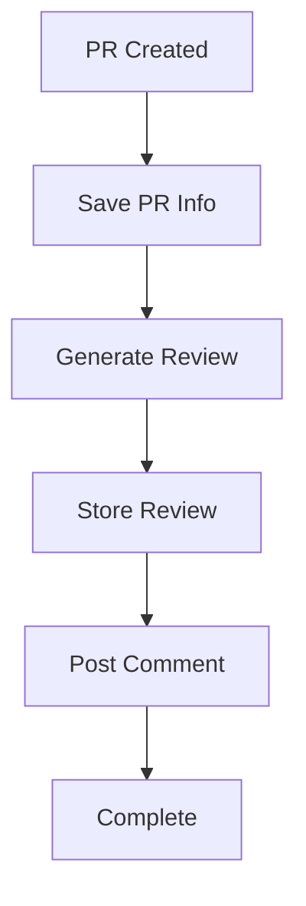

<!-- Please update as needed. -->

# Review Process Workflow

## Overview
This document describes the automated review process workflow, from Pull Request creation to review comment posting. The process is divided into several asynchronous jobs, each handling a specific part of the workflow.

## Detailed Workflow

### 1. Initial Webhook Processing
**Trigger: Pull Request Creation**
1. A user creates a Pull Request
2. GitHub App sends a webhook to the Liam server
3. The `github/route.ts` endpoint receives the webhook and queues the initial job

### 2. Save Pull Request (savePullRequest)
**Purpose: Persist PR information and initiate review process**

#### Process:
- Receives PR metadata from webhook
- Checks if the repository exists in the database
- Fetches PR files using GitHub API and creates fileChanges
- Stores PR information in Supabase
- On success: Triggers review generation
- On failure: Logs error and terminates process

#### Key Actions:
- Verify repository existence in the database
- Fetch PR files using GitHub API
- Create fileChanges from PR files
- Save or update PR record in the database
- Log success or error messages
- Trigger the generateReview task with fileChanges

### 3. Generate Review (generateReview)
**Purpose: Analyze PR and create review content**

#### Process:
- Analyzes PR content and changes
- Generates comprehensive review
- On completion: Queues review storage job

#### Key Deliverables:
- Code review comments
- Best practices suggestions
- Overall review summary

### 4. Store Review (saveReview)
**Purpose: Persist review results**

#### Process:
- Receives generated review content
- Stores review data in Supabase
- On success: Triggers comment posting
- On failure: Logs error and terminates process

#### Key Actions:
TBD

### 5. Post Comment (postComment)
**Purpose: Publish review results to GitHub**

#### Process:
- Formats review content for GitHub
- Posts review as PR comment
- On success: Workflow complete
- On failure: Logs error for manual intervention

## Error Handling
Each job includes:
- Error logging
- Failure state management
- Appropriate error responses

## Data Flow

## Technical Notes
- All jobs are asynchronous and queued
- Each job is idempotent
- Supabase is used as the persistent storage
- Environment variables required for configuration
- Logging implemented at each step for monitoring

## Job Dependencies
- `savePullRequest` → `generateReview`
- `generateReview` → `saveReview`
- `saveReview` → `postComment`
